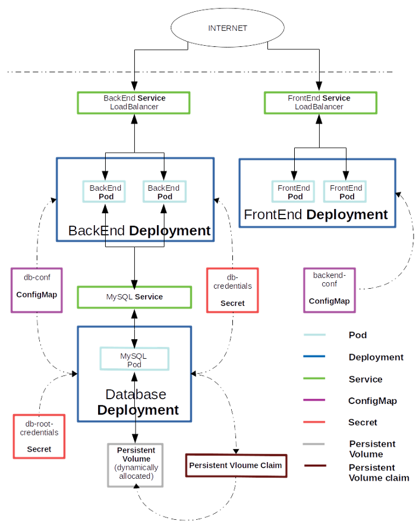

# TodoProjectFeBeMysql

https://medium.com/better-programming/kubernetes-a-detailed-example-of-deployment-of-a-stateful-application-de3de33c8632

https://github.com/shri-kanth/kuberenetes-demo-manifests

https://hub.docker.com/r/kubernetesdemo/to-do-app-frontend/

https://hub.docker.com/r/kubernetesdemo/to-do-app-backend/




```sh
user@pradeep-lab-system:~/projects/kubernetes/vagrant-provisioning$ kubectl get secrets -n default
NAME                  TYPE                                  DATA   AGE
db-credentials        Opaque                                2      6h30m
db-root-credentials   Opaque                                1      6h33m
default-token-97qmt   kubernetes.io/service-account-token   3      7h42m

user@pradeep-lab-system:~/projects/kubernetes/vagrant-provisioning$ kubectl get configmaps -n default
NAME           DATA   AGE
backend-conf   1      5h45m
db-conf        2      6h42m

user@pradeep-lab-system:~/projects/kubernetes/vagrant-provisioning$ kubectl get pods
NAME                                  READY   STATUS    RESTARTS   AGE
mysql-656c77d597-82rsm                1/1     Running   0          4h50m
to-do-app-backend-5b9496bf96-4bsqp    1/1     Running   1          4h50m
to-do-app-backend-5b9496bf96-cbfcq    1/1     Running   1          5h58m
to-do-app-frontend-76666776fc-bcr4d   1/1     Running   1          5h44m
to-do-app-frontend-76666776fc-tzmsq   1/1     Running   0          4h50m


user@pradeep-lab-system:~/projects/kubernetes/vagrant-provisioning$ kubectl get pv,pvc,storageclass -n default
NAME                                                        CAPACITY   ACCESS MODES   RECLAIM POLICY   STATUS   CLAIM                                STORAGECLASS   REASON   AGE
persistentvolume/pvc-19c2b98e-7be7-4ad1-a9e7-03cb0b01fdc7   1Gi        RWO            Delete           Bound    default/mysql-pv-claim               nfs-client              6h3m
persistentvolume/pvc-7030e9f2-6469-4687-ab3b-c5a240d6570d   8Gi        RWO            Delete           Bound    monitoring/prometheus-server         nfs-client              3h50m
persistentvolume/pvc-9b75e9c3-c8db-41b4-9ffa-40dd390d2ccc   2Gi        RWO            Delete           Bound    monitoring/prometheus-alertmanager   nfs-client              3h50m

NAME                                   STATUS   VOLUME                                     CAPACITY   ACCESS MODES   STORAGECLASS   AGE
persistentvolumeclaim/mysql-pv-claim   Bound    pvc-19c2b98e-7be7-4ad1-a9e7-03cb0b01fdc7   1Gi        RWO            nfs-client     6h3m

NAME                                               PROVISIONER              RECLAIMPOLICY   VOLUMEBINDINGMODE   ALLOWVOLUMEEXPANSION   AGE
storageclass.storage.k8s.io/nfs-client (default)   nfs-client-provisioner   Delete          Immediate           true                   6h10m


user@pradeep-lab-system:~/projects/kubernetes/vagrant-provisioning$ kubectl get deployments -n default
NAME                 READY   UP-TO-DATE   AVAILABLE   AGE
mysql                1/1     1            1           6h4m
to-do-app-backend    2/2     2            2           6h
to-do-app-frontend   2/2     2            2           5h46m

user@pradeep-lab-system:~/projects/kubernetes/vagrant-provisioning$ kubectl get deployments -n default
NAME                 READY   UP-TO-DATE   AVAILABLE   AGE
mysql                1/1     1            1           6h4m
to-do-app-backend    2/2     2            2           6h
to-do-app-frontend   2/2     2            2           5h46m


user@pradeep-lab-system:~/projects/kubernetes/vagrant-provisioning$ kubectl get replicasets -n default
NAME                            DESIRED   CURRENT   READY   AGE
mysql-656c77d597                1         1         1       6h5m
to-do-app-backend-5b9496bf96    2         2         2       6h1m
to-do-app-frontend-76666776fc   2         2         2       5h48m

user@pradeep-lab-system:~/projects/kubernetes/vagrant-provisioning$ kubectl describe services mysql
Name:              mysql
Namespace:         default
Labels:            app=mysql
                   tier=database
Annotations:       Selector:  app=mysql,tier=database
Type:              ClusterIP
IP:                None
Port:              <unset>  3306/TCP
TargetPort:        3306/TCP
Endpoints:         192.168.94.17:3306
Session Affinity:  None
Events:            <none>


user@pradeep-lab-system:~/projects/kubernetes/vagrant-provisioning$ kubectl describe services to-do-app-backend
Name:                     to-do-app-backend
Namespace:                default
Labels:                   <none>
Annotations:              Selector:  app=to-do-app,tier=backend
Type:                     NodePort
IP:                       10.105.139.184
Port:                     <unset>  80/TCP
TargetPort:               8080/TCP
NodePort:                 <unset>  31397/TCP
Endpoints:                192.168.94.16:8080,192.168.94.20:8080
Session Affinity:         None
External Traffic Policy:  Cluster
Events:                   <none>
user@pradeep-lab-system:~/projects/kubernetes/vagrant-provisioning$ kubectl describe services to-do-app-frontend
Name:                     to-do-app-frontend
Namespace:                default
Labels:                   <none>
Annotations:              Selector:  app=to-do-app,tier=frontend
Type:                     NodePort
IP:                       10.108.74.250
Port:                     <unset>  80/TCP
TargetPort:               8080/TCP
NodePort:                 <unset>  32181/TCP
Endpoints:                192.168.94.21:8080,192.168.94.24:8080
Session Affinity:         None
External Traffic Policy:  Cluster
Events:                   <none>


user@pradeep-lab-system:~/projects/kubernetes/vagrant-provisioning$ kubectl get svc
NAME                 TYPE        CLUSTER-IP       EXTERNAL-IP   PORT(S)        AGE
kubernetes           ClusterIP   10.96.0.1        <none>        443/TCP        7h49m
mysql                ClusterIP   None             <none>        3306/TCP       6h7m
to-do-app-backend    NodePort    10.105.139.184   <none>        80:31397/TCP   6h3m
to-do-app-frontend   NodePort    10.108.74.250    <none>        80:32181/TCP   5h49m


user@pradeep-lab-system:~/projects/kubernetes/vagrant-provisioning$ kubectl get pods -o wide
NAME                                  READY   STATUS    RESTARTS   AGE     IP              NODE                 NOMINATED NODE   READINESS GATES
mysql-656c77d597-82rsm                1/1     Running   0          4h55m   192.168.94.17   kworker1.mylab.com   <none>           <none>
to-do-app-backend-5b9496bf96-4bsqp    1/1     Running   1          4h55m   192.168.94.16   kworker1.mylab.com   <none>           <none>
to-do-app-backend-5b9496bf96-cbfcq    1/1     Running   1          6h4m    192.168.94.20   kworker1.mylab.com   <none>           <none>
to-do-app-frontend-76666776fc-bcr4d   1/1     Running   1          5h50m   192.168.94.24   kworker1.mylab.com   <none>           <none>
to-do-app-frontend-76666776fc-tzmsq   1/1     Running   0          4h55m   192.168.94.21   kworker1.mylab.com   <none>           <none>


user@pradeep-lab-system:~/projects/kubernetes/vagrant-provisioning$ kubectl get all
NAME                                      READY   STATUS    RESTARTS   AGE
pod/mysql-656c77d597-82rsm                1/1     Running   0          4h56m
pod/to-do-app-backend-5b9496bf96-4bsqp    1/1     Running   1          4h56m
pod/to-do-app-backend-5b9496bf96-cbfcq    1/1     Running   1          6h4m
pod/to-do-app-frontend-76666776fc-bcr4d   1/1     Running   1          5h51m
pod/to-do-app-frontend-76666776fc-tzmsq   1/1     Running   0          4h56m

NAME                         TYPE        CLUSTER-IP       EXTERNAL-IP   PORT(S)        AGE
service/kubernetes           ClusterIP   10.96.0.1        <none>        443/TCP        7h50m
service/mysql                ClusterIP   None             <none>        3306/TCP       6h9m
service/to-do-app-backend    NodePort    10.105.139.184   <none>        80:31397/TCP   6h4m
service/to-do-app-frontend   NodePort    10.108.74.250    <none>        80:32181/TCP   5h51m

NAME                                 READY   UP-TO-DATE   AVAILABLE   AGE
deployment.apps/mysql                1/1     1            1           6h9m
deployment.apps/to-do-app-backend    2/2     2            2           6h4m
deployment.apps/to-do-app-frontend   2/2     2            2           5h51m

NAME                                            DESIRED   CURRENT   READY   AGE
replicaset.apps/mysql-656c77d597                1         1         1       6h9m
replicaset.apps/to-do-app-backend-5b9496bf96    2         2         2       6h4m
replicaset.apps/to-do-app-frontend-76666776fc   2         2         2       5h51m
user@pradeep-lab-system:~/projects/kubernetes/vagrant-provisioning$ 


user@pradeep-lab-system:~/projects/kubernetes/vagrant-provisioning$ kubectl get nodes -o wide
NAME                 STATUS   ROLES    AGE     VERSION   INTERNAL-IP     EXTERNAL-IP   OS-IMAGE                KERNEL-VERSION           CONTAINER-RUNTIME
kmaster.mylab.com    Ready    master   7h51m   v1.18.5   172.42.42.100   <none>        CentOS Linux 7 (Core)   3.10.0-1127.el7.x86_64   docker://19.3.12
kworker1.mylab.com   Ready    <none>   7h49m   v1.18.5   172.42.42.101   <none>        CentOS Linux 7 (Core)   3.10.0-1127.el7.x86_64   docker://19.3.12
kworker2.mylab.com   Ready    <none>   7h46m   v1.18.5   172.42.42.102   <none>        CentOS Linux 7 (Core)   3.10.0-1127.el7.x86_64   docker://19.3.12

user@pradeep-lab-system:~/projects/kubernetes/vagrant-provisioning$ kubectl get svc -o wide
NAME                 TYPE        CLUSTER-IP       EXTERNAL-IP   PORT(S)        AGE     SELECTOR
kubernetes           ClusterIP   10.96.0.1        <none>        443/TCP        7h53m   <none>
mysql                ClusterIP   None             <none>        3306/TCP       6h11m   app=mysql,tier=database
to-do-app-backend    NodePort    10.105.139.184   <none>        80:31397/TCP   6h7m    app=to-do-app,tier=backend
to-do-app-frontend   NodePort    10.108.74.250    <none>        80:32181/TCP   5h53m   app=to-do-app,tier=frontend


You can access the application using :: MasternodeIP:to-do-app-frontend-port-number 
Example in this case  : http://172.42.42.100:32181 


user@pradeep-lab-system:~/projects/kubernetes/vagrant-provisioning$  kubectl exec -it -n default mysql-656c77d597-82rsm bash
kubectl exec [POD] [COMMAND] is DEPRECATED and will be removed in a future version. Use kubectl kubectl exec [POD] -- [COMMAND] instead.

root@mysql-656c77d597-82rsm:/# mysql -u root -p
Enter password:
Welcome to the MySQL monitor.  Commands end with ; or \g.
Your MySQL connection id is 1278
Server version: 5.7.30 MySQL Community Server (GPL)

Copyright (c) 2000, 2020, Oracle and/or its affiliates. All rights reserved.

Oracle is a registered trademark of Oracle Corporation and/or its
affiliates. Other names may be trademarks of their respective
owners.

Type 'help;' or '\h' for help. Type '\c' to clear the current input statement.

mysql> show databases;
+--------------------+
| Database           |
+--------------------+
| information_schema |
| mysql              |
| performance_schema |
| sys                |
| to-do-app-db       |
+--------------------+
5 rows in set (0.00 sec)

mysql> use to-do-app-db;
Reading table information for completion of table and column names
You can turn off this feature to get a quicker startup with -A

Database changed
mysql> show tables;
+------------------------+
| Tables_in_to-do-app-db |
+------------------------+
| ITEM                   |
| LIST_ENTITY            |
| schema_version         |
+------------------------+
3 rows in set (0.00 sec)

mysql> select * from ITEM;
+----+---------------------+---------+---------------------+-------------+---------+----------+
| ID | CREATED_ON          | DELETED | MODIFIED_ON         | NAME        | LIST_ID | POSITION |
+----+---------------------+---------+---------------------+-------------+---------+----------+
|  1 | 2020-07-13 14:36:10 |       0 | 2020-07-13 14:36:10 | Rice/Curry  |       3 |        0 |
|  2 | 2020-07-13 14:36:20 |       0 | 2020-07-13 14:36:20 | Barista     |       1 |        0 |
|  3 | 2020-07-13 14:36:28 |       0 | 2020-07-13 14:36:28 | Continental |       2 |        0 |
|  4 | 2020-07-13 14:36:54 |       0 | 2020-07-13 14:36:54 | Green Salad |       4 |        0 |
|  5 | 2020-07-13 14:37:10 |       0 | 2020-07-13 14:37:10 | Fruit Bowl  |       5 |        0 |
+----+---------------------+---------+---------------------+-------------+---------+----------+
5 rows in set (0.00 sec)

mysql> select * from LIST_ENTITY;
+----+---------------------+---------+---------------------+----------------+----------+
| ID | CREATED_ON          | DELETED | MODIFIED_ON         | NAME           | POSITION |
+----+---------------------+---------+---------------------+----------------+----------+
|  1 | 2020-07-13 14:28:42 |       0 | 2020-07-13 14:28:42 | Morning Coffee |        0 |
|  2 | 2020-07-13 14:28:58 |       0 | 2020-07-13 14:28:58 | Breakfast      |        1 |
|  3 | 2020-07-13 14:29:08 |       0 | 2020-07-13 14:29:08 | Lunch          |        2 |
|  4 | 2020-07-13 14:29:21 |       0 | 2020-07-13 14:29:21 | Snacks         |        3 |
|  5 | 2020-07-13 14:37:01 |       0 | 2020-07-13 14:37:01 | Dinner         |        4 |
+----+---------------------+---------+---------------------+----------------+----------+
5 rows in set (0.00 sec)

mysql>


Note : We need to pass IP address of KMASTER node : With PORT number of to-do-app-backend service

user@pradeep-lab-system:~/projects/terraform/ToDoApplication$ cat backend-configmap.yaml
# ConfigMap to expose configuration related to backend application
apiVersion: v1
kind: ConfigMap
metadata:
  name: backend-conf # name of configMap
data:
  server-uri:  172.42.42.100:31397 # external ip of backend application 'Service'

```
